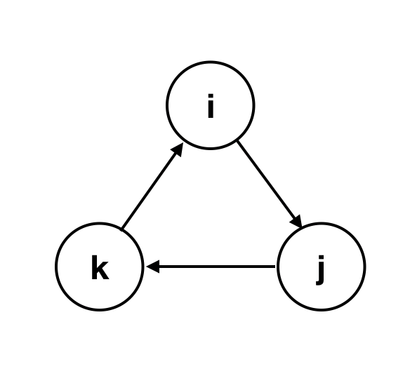
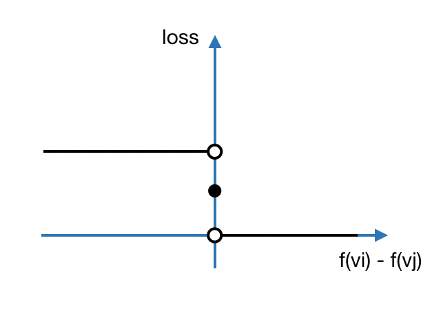
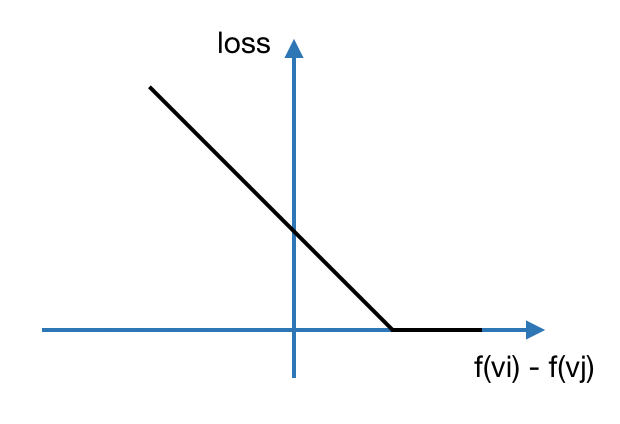

```{r setup, include=FALSE}
knitr::opts_chunk$set(echo = FALSE)
```


## Introduction

The problem is called __rank aggregation__, which consider this situation that given the results of multiple pairwise comparisons of items, want to know the overall ranking of all items. The resulted overall ranking should match the pairwise comparisons to the largest extent. 

The problem could be formulated as the following: 
given $n$ items $\{1,2,\dots,n \}$ to be compared and assume there is a latent preference matrix $P \in [0,1]^{n\times n}$. The entry $P_{i,j}$ in $P$ denote the probability item $x_i$ will beat item $x_j$. The probability could be $0$ or $1$ for deterministic/noiseless case and in $(0,1)$ if the observations are noisy. 

To formulate this problem as a __reasonable__ and __solvable__ ranking problem, we require these two following constrains on matrix $P$:  
1. For each pair of items $x_i$ and $x_j$, it is rather $x_i$ beats $x_j$ or $x_j$ beats $x_i$, thus $P_{ij} + P_{ji} =1$. (We will also consider $x_i$ ties $x_j$ in some special case.)  
2. __Stochastic transitivity__(ST) condition (Directed Acyclic Graph): if $P_{ij} > \frac{1}{2}$ and $P_{jk} > \frac{1}{2}$, then $P_{ik} > \frac{1}{2}$. That is saying if there is an item $i$ ranked higher than $j$ and $j$ higher than $k$ with high probability, then $i$ should also beat $j$ with high probability. 

<aside>
```{r,fig.cap="An invalid setting where i beats j, j beats k and k beats i"}

```
</aside>


## Deterministic Ordering
First consider a simply case addressed as deterministic ordering. In this setting, $P_{ij} \in \{0,1, \forall i \neq j$, which is saying that, for a latent ranking function $f(x)$ such that $f(i) > f(j)$, $i$ will always beat $j$ in comparisons. This paper[@agarwal2006ranking] studies this setting on graph data (the similarity between items are considered) and proposes an algorithm with an RKHS interpretation.

### Ranking on Graph Data
Weighted data graph $G=(V,E,w)$, where $w_{ij}$ on edge $e_{ij}$ represents similarity between $v_1$ and $v_n$. We also have access to an order graph $\Gamma = (V,\Sigma,\tau)$ and $\tau : \Sigma \rightarrow \mathbb{R}^{+}$ is the penalty for misranking $(v_i,v_j) \in \Sigma$, which denotes in this comparison $v_i$ is ranked higher than $v_j$.

The goal is to learn a ranking/score function for vertices/items in $V$, denoted by $f:V \rightarrow \mathbb{R}$. Let $\mathbf{f} \in \mathbb{R}^n$, where $f_i = f(v_i)$ the ranking for $v_i$.

Empirically define the loss of misranking $(v_i,v_j)$ as $$\ell(f;v_i,v_j) = \begin{cases}
                        1 \quad \text{if $f(v_i) < f(v_j)$} \\
                         \frac{1}{2} \quad\text{if $f(v_i) = f(v_j)$} \\
                         0 \quad \text{if $f(v_i) < f(v_j)$}
                        \end{cases}$$

<aside>
```{r,fig.cap="The step function like loss function."}

```
</aside>

So given a function $f$, the empirical error is
$$\hat{R}(f;\Gamma)= \frac{1}{|\Sigma|}\sum_{(v_i,v_j)\in \Sigma} \tau(v_i,v_j)\cdot\ell(f;v_i,v_j).$$  
As the objective above is step-function which is hard to minimize, similar using hinge loss as a surrogate of $(0,1)$-loss,
we use
$$\ell_{h}\left(f ; v_{i}, v_{j}\right)=\left(1-\left(f\left(v_{i}\right)-f\left(v_{j}\right)\right)\right)_{+},$$  

<aside> 
```{r,fig.cap="The continuous function upper bounded 0-1 loss.",preview=TRUE}

```
</aside> 

and the empirical loss becomes
$$\hat{R}_{\ell_{h}}(f ; \Gamma)=\frac{1}{|\Sigma|} \sum_{\left(v_{i}, v_{j}\right) \in \Sigma} \tau\left(v_{i}, v_{j}\right) \cdot \ell_{h}\left(f ; v_{i}, v_{j}\right).$$  
Then we could formulate this problem as an optimazation problem
$$\min _{f : V \rightarrow \mathbb{R}}\left\{\hat{R}_{\ell_{h}}(f ; \Gamma)+\lambda \mathcal{S}(f)\right\},$$  

where the penalty term is 
$$\mathcal{S}(f)=\mathbf{f}^{T} \mathbf{L} \mathbf{f},$$ 
and $L$ is the normalized Laplacian matrix for data graph $G$.  

<aside>
Normalized Laplacian matrix is defined as 
$$\mathbf{L}=\mathbf{D}^{-1 / 2}(\mathbf{D}-\mathbf{W}) \mathbf{D}^{-1 / 2},$$ 
where $D$ is a diagonal matrix of outer degree and $W$ the weighted adjacency matrix. More details see the wikipedia page of [Laplacian matrix](https://en.wikipedia.org/wiki/Laplacian_matrix).
</aside>  

### Interpretation of penalty term
As we are given the data graph, a regularizer term could be set as to encourage the __smoothness__ of the learned function with respect to the similarity between items, which means items with high similarity should have similar ranking.  
Defind the degree function of $G$ as 
$$d\left(v_{i}\right)=\sum_{j :\left\{v_{i}, v_{j}\right\} \in E} w\left(v_{i}, v_{j}\right)$$
First introduce the _edge derivative_ of a function $f$ along edge ${v_i,v_j} \in E$ at vertex $v_i$ is
$$\left.\frac{\partial f}{\partial\left\{v_{i}, v_{j}\right\}}\right|_{v_{i}}=\sqrt{\frac{w\left(v_{i}, v_{j}\right)}{d\left(v_{i}\right)}} f\left(v_{i}\right)-\sqrt{\frac{w\left(v_{i}, v_{j}\right)}{d\left(v_{j}\right)}} f\left(v_{j}\right),$$
which gives more weight to edges with larger $w(v_i,v_j)$.  

Then the _local variation_ for a node $v_i$ is  
$$\left\|\nabla_{v_{i}} f\right\|=\sqrt{\sum_{j :\left\{v_{i}, v_{j}\right\} \in E}\left(\left.\frac{\partial f}{\partial\left\{v_{i}, v_{j}\right\}}\right|_{v_{i}}\right)^{2}}$$    
So the total smoothness of $f$ over all nodes is  
$$\mathcal{S}(f)=\frac{1}{2} \sum_{i=1}^{n}\left\|\nabla_{v_{i}} f\right\|^{2}.$$  
Normalized Laplacian matrix  
$$\mathbf{L}=\mathbf{D}^{-1 / 2}(\mathbf{D}-\mathbf{W}) \mathbf{D}^{-1 / 2}$$  
And this term is exactly 
$$\mathcal{S}(f)=\mathbf{f}^{T} \mathbf{L} \mathbf{f}.$$  
If consider $\mathcal{F}$ as column space of $L^+$, it is easy to see tha $\mathcal{F}$ is an [Reproducing kernel Hilbert space](https://en.wikipedia.org/wiki/Reproducing_kernel_Hilbert_space) (as $L$ is symmetric p.s.d.).
We could rewrite this term as \(\mathcal{S}(f)=\|\mathbf{f}\|_{\mathcal{F}}^{2}\), which is an $L2$-regularization in a given RKHS.

### Stability bound for biparte graph 
This RKHS interpretation could lead to a stability bound for this algorithm with special case. This case considers the order graph $\Gamma$ as a "fully connected" biparte graph with two part $S_+$ and $S_-$, where $\forall v \in S_+$ and $\forall u \in S_-$, there is a directed edge $(v,u)$. Under this special case, the order data is not very different from having binary labels.  
The formal statement could be found in __Theorem 1__ [@agarwal2006ranking] and the proof can be found in Theorem 3 and 4 from their previous work on biparte graph [@agarwal2005stability].  

<aside>
By __stability bound__, here we mean the expected error are bounded by empirical error plus some terms for a stable algorithm. More details about this bound could be found in [@bousquet2002stability].
</aside>


## Classes of Preference Matrices 
After the simplest deterministic case, we now consider the probabilistic(noisy) setup. There are actually several common models that have been explored. The description is borrowed from [@rajkumar2016can].  

### General Condition 
To summerize those conditions described informally in Introduction, all preferences matrices should be in this set
$$\mathcal{P}_{n}=\left\{\mathbf{P} \in[0,1]^{n \times n} | P_{i j}+P_{j i}=1 \forall i, j\right\}.$$
Those satisfy stochastic transitivity (ST) condition 
$$\mathcal{P}_{n}^{\mathrm{ST}}=\left\{\mathbf{P} \in \mathcal{P}_{n} | i>\mathbf{p} j, j>_{\mathbf{P}} k \Longrightarrow i>_{\mathbf{P}} k\right\}.$$
Deterministic ordering (DO) model in part 2 have preferences matrices
$$\mathcal{P}_{n}^{\mathrm{DO}}=\left\{\mathbf{P} \in \mathcal{P}_{n} | \exists \sigma \in \mathcal{S}_{n} : \sigma(i)<\sigma(j) \Longrightarrow P_{i j}=1\right\}.$$  

### Undeterministic models 
__Noisy permutation__ model
$$\mathcal{P}_{n}^{\mathrm{NP}}=\left\{\mathbf{P} \in \mathcal{P}_{n} | \exists \sigma \in \mathcal{S}_{n}, p \in\left[0, \frac{1}{2}\right) : \sigma(i)<\sigma(j) \Longrightarrow P_{i j}=1-p\right\}$$
$$\mathcal{P}_{n}^{\mathrm{DO}} \subseteq \mathcal{P}_{n}^{\mathrm{NP}} \subseteq \mathcal{P}_{n}^{\mathrm{ST}}$$  
__Bradley-Terry-Luce__ model  
For BTL model, there is a scoring/ranking $w_i$ for each item $i$, and 
$$\mathcal{P}_{n}^{\mathrm{BTL}}=\left\{\mathbf{P} \in \mathcal{P}_{n} | \exists \mathbf{w} \in \mathbb{R}_{++}^{n} : P_{i j}=\frac{w_{i}}{w_{i}+w_{j}} \forall i, j\right\}.$$
__Thurstone__ model  
Thurstone model is similar to BLT model, but using a different link function for probability:
$$\mathcal{P}_{n}^{\text { Thu }}=\left\{\mathbf{P} \in \mathcal{P}_{n} | \exists \mathbf{s} \in \mathbb{R}^{n} : P_{i j}=\Phi\left(s_{i}-s_{j}\right) \forall i, j\right\}.$$


## Iterative Ranking from Pair-wise Comparisons (Random Walk)

### Introduction
_Rank Centrality_ in [@negahban2012iterative] is an algorithm that uses the concept of random walk to solve this rank aggregation problem. The intuition is to construct a random walk that it is likely to go from $v_i$ to $v_j$ if item $i$ has rank lower than $j$. When it reaches a balance state(stationary distribution), the distribution will tend to be close to the ranking/weight of items. This idea is actually similar to Google's PageRank.

```{r fig.cap="PageRank, resource: https://en.wikipedia.org/wiki/File:PageRanks-Example.jpg" ,fig.align="center",fig.width=4, fig.height=4,out.extra="class=external"}
knitr::include_graphics('img/PageRank.jpg')
```

### Random walk approach
For this problem, we use BLT model as a demonstration, but the algorithm itself is model independent.
Consider $n$ items and a weight score $w_i \in \mathbb{R}_+$ for each item. In this setting, a pair of items are compared $k$ times in total, then denote the result by $Y^l_{ij}$ be $1$ if $j$ is prefered and $0$ otherwise $1 \leq l \leq k$. Then we define $2$ terms as follows: 
* $a_{ij}$ the fraction of times $j$ prefered over $i$. \(a_{i j}=(1 / k) \sum_{l=1}^{k} Y_{i j}^{l}\)  
* $A_{i j}$ If the random walk is on a weighted graph $G=([n],E,A)$. The weighted edge \(A_{i j}=a_{i j} /\left(a_{i j}+a_{j i}\right)\), \(A_{j i}=a_{j i} /\left(a_{i j}+a_{j i}\right)\) 

<!-- The BTL model gives us \(\mathbb{P}\left(Y_{i j}^{l}=1\right)=\frac{w_{j}}{w_{i}+w_{j}}\).  -->

<aside>
Notice that here the edge weight is not the cost, but the probability of going from one vertex to another.
</aside>

In this random walk, the probability(edge weight) walks from item $i$ to item $j$ is \(P_{ij}=\mathbb{P}\left(X_{t+1}=j | X_{t}=i\right)\).  By definition, the transition matrix should be row stochastic, i.e. $\sum_j P_{ij} =1$. Scale all edge weights by $1/d_{max}$ the maximum out-degree and add self-loop to those nodes with out-degree less than $d_{max}$:

$$P_{i j}=\left\{\begin{aligned} \frac{1}{d_{\max }} A_{i j} &\quad \text { if } i \neq j \\ 1-\frac{1}{d_{\max }} \sum_{k \neq i} A_{i k} &\quad \text { if } i=j \end{aligned}\right.$$
To see the stationary distribution of this random walk is exactly the $\mathbf{w}$ we want:  
__Asymptotically__ (to say $k \rightarrow \infty$ ) $P$ would define a reversible Markov chain, which is saying \(\pi_{i}=v_{i} /\left(\sum_{j} v_{j}\right)\) is a _unique_ stationary distribution.   
Also in the ideal setting, $P_{ij}=\tilde{P}_{ij}=\left(1 / d_{\max }\right) w_{j} /\left(w_{i}+w_{j}\right)$ is a _valid_ stationary distribution. So this random walk constructed has a stationary distribution $\pi = \mathbf{w}$.

### Error Bound
Each pair is chosen with probability $d/n$. Then there exists positive universal constatns $C,C',C''$ such that when $d\geq C(log n)^2$, and $k d \geq C b^5 \log n$, the following bound on the error rate hold with probability at least $1-C''/n^3$:
$$\frac{\|\pi-\tilde{\pi}\|}{\|\tilde{\pi}\|} \leq C^{\prime} b^{3} \sqrt{\frac{\log n}{k d}},$$ 
where \(\tilde{\pi}(i)=w_{i} / \sum_{\ell} w_{\ell}\) and \(b \equiv \max _{i, j} w_{i} / w_{j}\). More details could be found in __Theorem 1__[@negahban2012iterative].  

### Mixing time
However, the mixing time is quite long due to the self-loop. Another recent paper [@agarwal2018accelerated] tries to address this problem by using a slightly different construction for the random walk. Instead of scaling all rows by the max out-degree, this algorithm scales different rows using the out-degree of corresponding node:
$$P_{i j}^{acc}=\left\{\begin{aligned} \frac{1}{d_{i }} A_{i j} &\quad \text { if } i \neq j \\ 0 &\quad \text { if } i=j \end{aligned}\right.$$  
The detailed balance equation then becomes
$$w_{i} d_{i} P_{i j}^{acc}=w_{j} d_{j} P_{j i}^{acc},$$ then it is easy to see the stationary distribution of this random walk is $\pi^{acc} = \mathbf{D} \mathbf{w} /\|\mathbf{D} \mathbf{w}\|_{1}$, where $\mathbf{D}$ is the diagonal matrix where $\mathbf{D}_{ii}=d_i$.

Intuitively we know the random walk with less self-loop should have a smaller mixing time. This statement could be proved rigourously by considering _spectral gap_ of the transition matrix (See __Lemma 1__ and __proposition 2__ in [@agarwal2018accelerated]).

## Low rank completion 
In this paper[@rajkumar2016can], it introduces a new class of preference matrices, which is __Low rank__ matrix. The definition of this class of matrices is as follows: 
_Let \(\psi :[0,1] \rightarrow \mathbb{R}\) be a link function and $r \in [n]$. Define the class of rank-$r$ preference matrices under $\psi$ as_
$$\mathcal{P}_{n}^{\mathrm{LR}(\psi, r)}=\left\{\mathbf{P} \in \mathcal{P}_{n} | \operatorname{rank}(\psi(\mathbf{P})) \leq r\right\}.$$ 
It is mentioned in the paper that both BTL and Thurstone model are special cases of this more general class of preference matrices, thus this ranking problem could be reformulated as a low-rank completion problem.

## Summary 
The rank aggregation problem is a common model in real-life applications such as sports, recommendation systems, etc. In this article, my sight is limited to pairwise comparisons, while there is a more general setting that an item is compared to a subset of items. There are also abundent works on active choosing samples under this situation. 
Some possible future works could be to have better bound or better sample complexity as well as to explore more posibiliies on active selecting samples.

## Acknowledgments {.appendix}

Distill is a publication format for scientific and technical writing, native to the web.

Learn more about using Distill at <https://rstudio.github.io/distill>.

